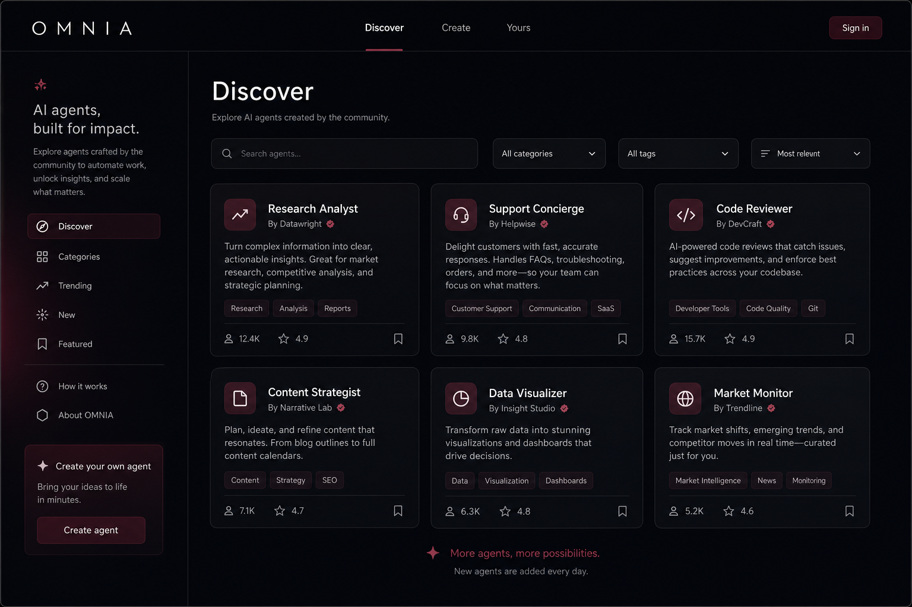

# OMNIA

**Don't hire another bot. Build an expert.**

Tell OMNIA the outcome you want. It designs the intelligence, tools, memory, interface, and evaluation—then gives you an agent ready to work.

### Live demo

**[Open OMNIA →](https://omnia-wine.vercel.app/explore)**



---

## What you can do

- **Discover** — Browse agents built by others. Find something useful, then add it to your library.
- **Create** — Describe the outcome in plain language. OMNIA interviews you and builds a full agent system—no code required.
- **Yours** — Your private workspace. Run, refine, and evolve the agents you own.

Also: built-in evaluation, save privately or publish to Discover, and evolve agents over time.

---

## Stack

| Layer | Tech |
| --- | --- |
| Web | Next.js (App Router) |
| API | FastAPI |
| Data | PostgreSQL, Redis, Qdrant (via Docker Compose) |

Live web: [omnia-wine.vercel.app](https://omnia-wine.vercel.app)  
Live API: [omnia-api-ten.vercel.app](https://omnia-api-ten.vercel.app)

---

## Run locally

**Prerequisites:** Docker, Node.js 18+, Python 3.11+ (if running the API outside Docker).

1. **Clone and configure env**

   ```bash
   cp .env.example .env
   ```

   Set at least `OPENAI_API_KEY` and a strong `JWT_SECRET`. See `.env.example` for optional providers and OAuth. Never commit real secrets.

2. **Start infrastructure + API (recommended)**

   ```bash
   docker compose up -d postgres redis qdrant api
   ```

   API: [http://localhost:8000](http://localhost:8000)

3. **Start the web app**

   ```bash
   cd apps/web
   npm install
   npm run dev
   ```

   Web: [http://localhost:3000](http://localhost:3000)

   Ensure `NEXT_PUBLIC_API_URL=http://localhost:8000` in your env (see `.env.example`).

**Full stack via Compose:** `docker compose up` also builds the Next.js `web` service on port 3000.

---

## Repo layout

```
apps/web   # Next.js frontend
apps/api   # FastAPI backend
docs/      # Specs and product notes
```

---

© 2026 OMNIA
